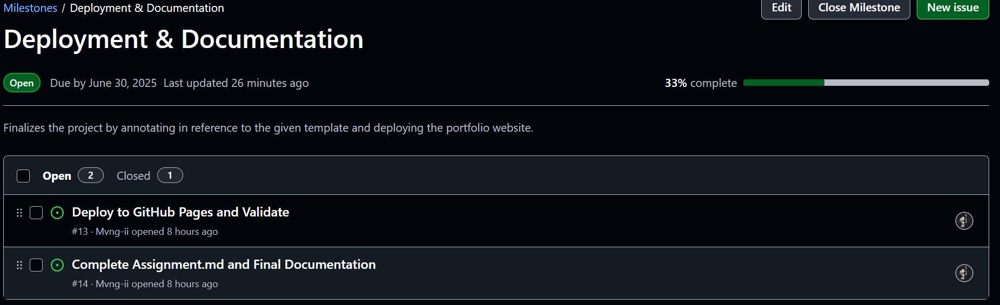
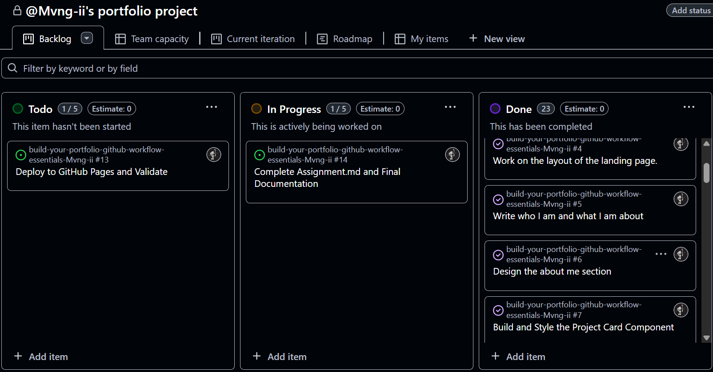
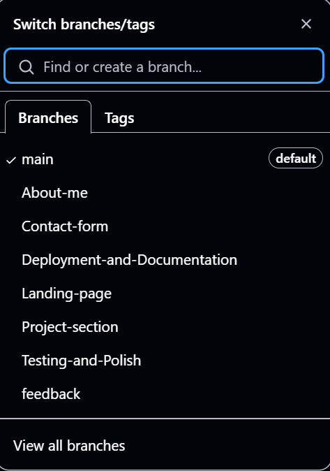
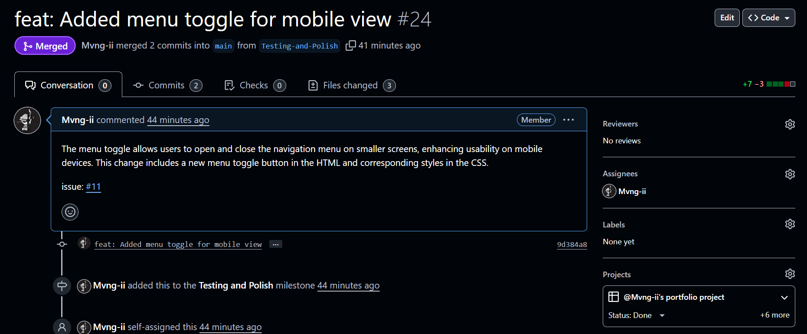
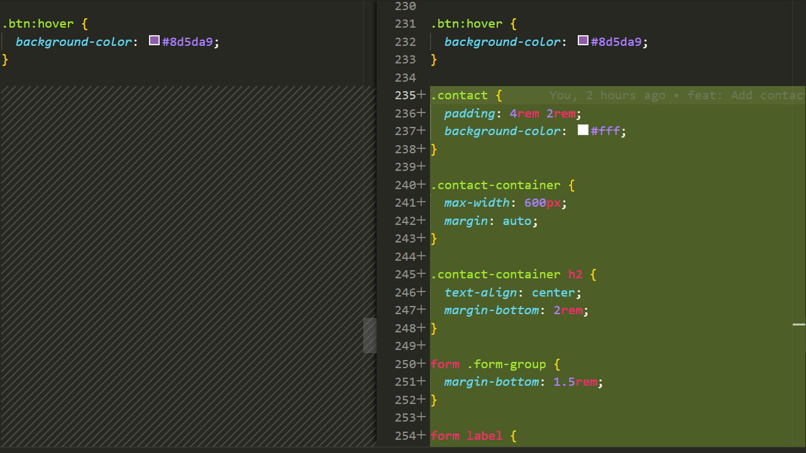

# Personal Portfolio Documentation

## 1. Student Details

- **Mwangi Victor Mbugu**:
- **151176**:
- **Mvng-ii**:
- **victor.mbugu@strathmore.edu**:

## 2. Deployed Portfolio Link

- **GitHub Pages URL**:  
  _(https://is-project-4th-year.github.io/build-your-portfolio-github-workflow-essentials-Mvng-ii/)_


## 3. Learnings from the Git Crash Program

### **🧠 What I Thought I'd Learn vs What I Actually Learned**

**1. Concept: Branching**

`Expectation 👀`: I assumed branching was mostly for large team projects.

`Reality 😅`: Even solo developers benefit a lot! It helped me safely experiment with sections like About Me without damaging the main code.

`Impact 💡`: I created separate branches for each milestone, tested safely, and merged confidently via pull requests.

---

**2. Concept: Pull Requests**

`Expectation 👀`: I thought pull requests were just for team code reviews.

`Reality 😅`: Turns out, they’re also great for personal accountability and clear documentation of changes.

`Impact 💡`: I used pull requests for each milestone. It made the review and merging process clean and traceable.

---

**3. Concept: Project Boards**

`Expectation 👀`: I didn’t think I’d need a board for a small project.

`Reality 😅`: Project boards helped me visually track progress and prioritize my work better.

`Impact 💡`: I used “To Do”, “In Progress”, and “Done” columns and moved issues across them as I completed each feature.

---

**4. Concept: Merge Conflicts**

`Expectation 👀`: I thought Git magically handled all code merges.

`Reality 😅`: I encountered a merge conflict and had to resolve it manually by choosing what code to keep.

`Impact 💡`: I simulated and resolved a merge conflict between the “projects” and “about” section branches—learned a lot!

---

## 4. Screenshots of Key GitHub Features

```markdown

```

### A. Milestones and Issues



- Shows milestones created for each section with issues linked to them

### B. Project Board



- Shows tasks moving through To Do, In Progress, and Done columns.

### C. Branching



- This displays the branch list with meaningful naming.

### D. Pull Requests



- Shows a Pull Request linked to an issue with proper commit messages and discussion.

### E. Merge Conflict Resolution



- Shows manual conflict resolution in GitHub or your code editor.
